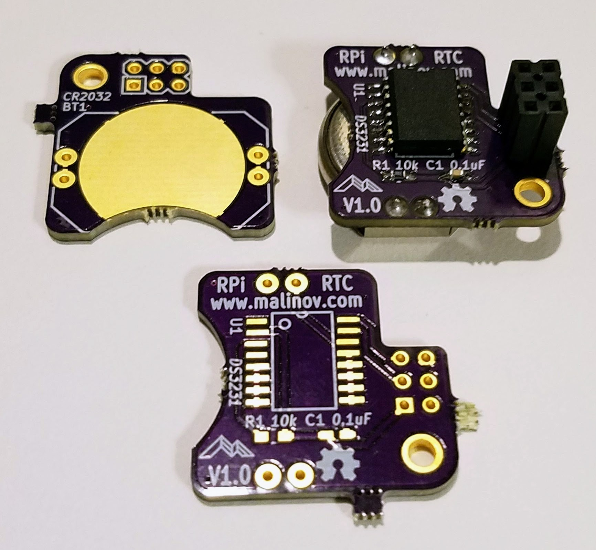
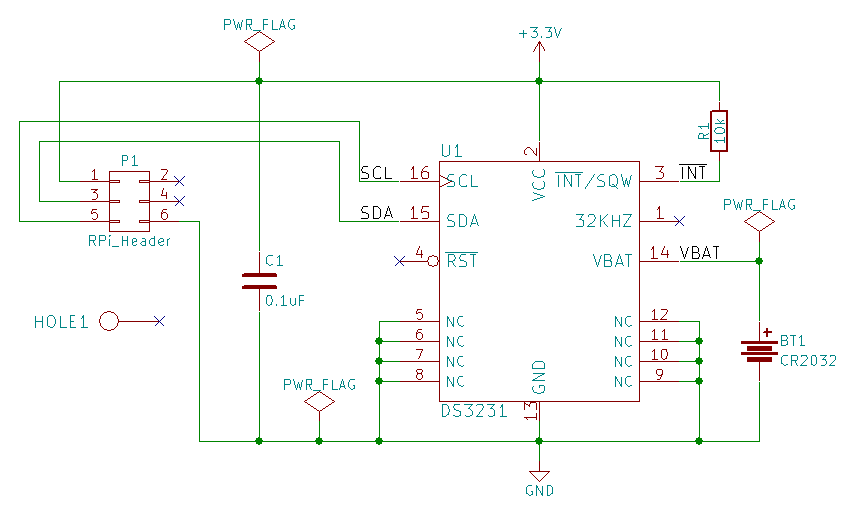

# RPi DS3231 RTC
Maxim DS3231 Based RTC Module for Raspberry Pi

## Introduction
This is a real-time clock (RTC) module for Raspberry Pi and Raspberry Pi Zero. The module is similar to [Adafruit PiRTC](https://www.adafruit.com/product/3386), but uses the highly accurate [Maxim Integrated DS3231](https://www.adafruit.com/product/3386) RTC IC with an integrated temperature-compensated crystal oscillator, and more common CR2032 battery.

## Hardware Documentation

### Schematic and PCB Layout

### Bill of Materials

[RPi DS3231 RTC project on Mouser.com](https://www.mouser.com/ProjectManager/ProjectDetail.aspx?AccessID=eede7ef873) - View and order all components except of the PCB.

[RPi DS3231 RTC on OSH Park](https://oshpark.com/shared_projects/tu7lVnCo) - View and order the PCB.

Component type     | Reference | Description                       | Quantity | Possible sources and notes 
------------------ | --------- | --------------------------------- | -------- | --------------------------
PCB                |           | RPi DS3231 RTC PCB - Version 1.0  | 1        | Order from [OSH Park](https://oshpark.com/shared_projects/tu7lVnCo)
Integrated Circuit | U1        | Maxim DS3231                      | 1        | Mouser [700-DS3231S#T&R-](https://www.mouser.com/ProductDetail/700-DS3231S%23TR-)
Capactior          | C1        | 0.1uF, 0603                       | 6        | Mouser [77-VJ0603Y104JXJPBC](https://www.mouser.com/ProductDetail/77-VJ0603Y104JXJPBC)
Resistor           | R1        | 10 kohm, 0603                     | 1        | Mouser [71-CRCW060310K0FKEB](https://www.mouser.com/ProductDetail/71-CRCW060310K0FKEB)
Connector          | P1        | 3x2, 2.54 mm, socket              | 1        | Mouser [517-929852-01-03-RA](https://www.mouser.com/ProductDetail/517-929852-01-03-RA)
Battery Holder     | BT1       | CR2032 Battery Holder             | 1        | Mouser [712-BAT-HLD-001-THM](https://www.mouser.com/ProductDetail/712-BAT-HLD-001-THM)
Battery            | BT1       | CR2032                            | 1        | Mouser [658-CR2032](https://www.mouser.com/ProductDetail/658-CR2032)

## Software Documentation

### Raspbian Configuration

The following steps assume that you have a fairly new Rapbian distribution installed and running on your Rapsberry Pi, and that RPi DS3231 RTC module is plugged into the Raspberry Pi.

#### Enable I2C Support

Run `raspi-config`:

    $ sudo raspi-config
    
Navigate to the *Interfacing Options* menu. If this menu is missing (on older Raspbian versions), try the *Advanced Options* menu instead.
Next, select the *I2C* menu, and answer *Yes* to *Would you like the ARM I2C interface to be enabled?* and *Would you like the I2C kernel modules to be loaded by default?* questions.

Reboot the system

#### Verify that RTC Module Is Detected

Install `i2c-tools` package:

    $ sudo apt-get install i2c-tools

Run `i2cdetect -y 1` command and verify that the I2C device is detected at address 0x68:

    $ sudo i2cdetect -y 1
         0  1  2  3  4  5  6  7  8  9  a  b  c  d  e  f
    00:          -- -- -- -- -- -- -- -- -- -- -- -- --
    10: -- -- -- -- -- -- -- -- -- -- -- -- -- -- -- --
    20: -- -- -- -- -- -- -- -- -- -- -- -- -- -- -- --
    30: -- -- -- -- -- -- -- -- -- -- -- -- -- -- -- --
    40: -- -- -- -- -- -- -- -- -- -- -- -- -- -- -- --
    50: -- -- -- -- -- -- -- -- -- -- -- -- -- -- -- --
    60: -- -- -- -- -- -- -- -- 68 -- -- -- -- -- -- --
    70: -- -- -- -- -- -- -- --

#### Enable Kernel Support for DS3231 RTC

Open `/boot/config.txt` in your favorite editor (nano, vi) as root. For example:

    $ sudo nano /boot/config.txt

Add the following lines at the end of the file:

    # Enable DS3231 RTC
    dtoverlay=i2c-rtc,ds3231

Remove `fake-hwclock` package:

    $ sudo apt-get -y remove fake-hwclock
    $ sudo update-rc.d -f fake-hwclock remove

Enable setting up system time to the RTC time at boot. Open `/lib/udev/hwclock-set` in your favorite editor:

    $ sudo nano /lib/udev/hwclock-set

And comment out the following lines:

    #if [ -e /run/systemd/system ] ; then
    # exit 0
    #fi

Save the file, and reboot the system

#### Setting and Reading the RTC time from Command Line

* Use `hwclock -w` command to set the RTC time to the system time. You can use `date` command to set and verify the system time prior to writing it to the RTC.
* Use `hwclock --set --date=<date_string>` command to set the RTC time to the time given by <date_string>
* Use `hwclock -r` command to read the time from the RTC
